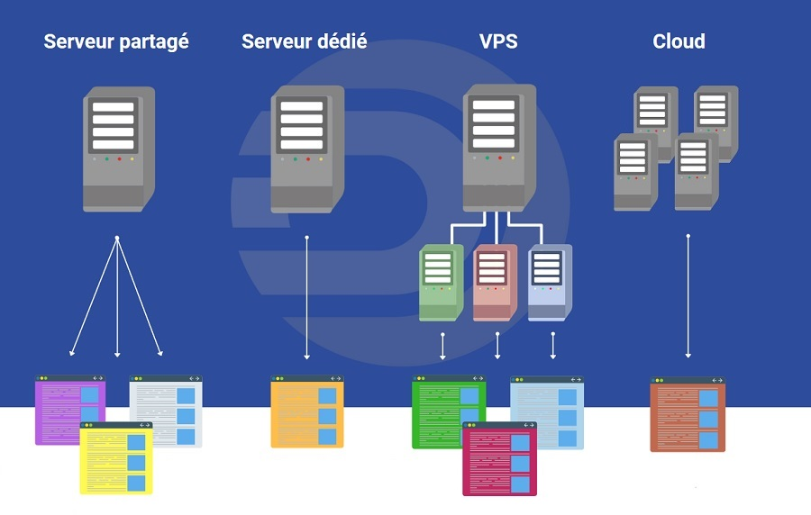
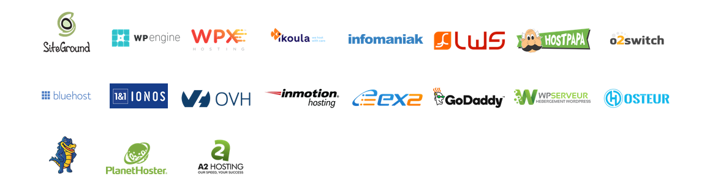

# Hebergement

## Présentation

En tant que futur développeur en formation, on as pour le moment travaillais essentiellement dans un environnement de développement.
Nos formateurs étant là pour mettre en production à notre place.
Mais avec les futur entretient et recherche de stage, vous souhaiterez peut etre lancer prochainement votre site internet comme un portfolio ? 
 
Tout commence par l’hébergement web !

L’hébergement web fait partie intégrante du processus de création d’un site Web : le rôle principal de l’hébergeur est de mettre à disposition des internautes le contenu développé par le développeur ou son entreprise.

## Définition de l’hébergement web

Définissons d’abord ce qu’est l’hébergement web. Lorsque vous vous rendez sur un site web depuis votre navigateur, votre ordinateur reçoit un message écrit dans les langages du web. Votre navigateur traduit ce langage sous la forme que vous connaissez : images, textes, tout ce qui compose une page web.

Ce code provient de différents fichiers qui eux ont besoin d’un espace de stockage : cet espace est ce qu’on appelle un serveur. 

Ce dernier est composé d’un ordinateur qui contient de la mémoire, un disque dur et un système d’exploitation.
Techniquement, chacun d'entre vous pourrez héberger son propre serveur aux final .

Mais cela demande un minimum de connaissance, et des ressources ! C'est pourquoi il existe des hébergeurs qui possédent énormement de serveurs entreposer dans ce qu'on appel des Datacenters.

Pour résumer : l’hébergeur web est l’entreprise qui est propriétaire des serveurs où sont stockées les informations liées à votre site web. Généralement, en plus de vendre de l’espace sur des serveurs, 
les hébergeurs web proposent aussi des services de gestion de serveurs, de soutien informatique, d’antivirus et de sauvegarde de sites web.

## Les différents type d'hébergeur

* Mutualisé

L'hébergement partagé (aussi appelé mutualisé) signifie que vous partagez un serveur avec d'autres sites et comptes d'hébergement. 
Les fonctionnalités et performances sont souvent plus limités et ces forfaits sont généralement destinées aux sites qui n'utilisent pas beaucoup de bande passante. 
Parfait si vous débutez ou si votre site est de petite taille et ne génère pas trop de trafic !
Il s’agit de la solution la plus économique si on ne compte pas les hébergement gratuit que nous verrons plus tard.

Est-ce que l’hébergement partagé peut être une bonne option ? OUI ! Pour les sites web en développement, les sites de tests ou encore ceux où la vitesse de chargement n’est pas un élément important.

* Dédiés

Avec de l'hébergement dédié, vous disposez de l'ensemble du serveur web pour votre propre usage, ce qui se traduit par de meilleures performances, des sites plus rapides et des meilleures fonctionnalités et options de paramétrage. 
Le bon choix si vous possédez plusieurs sites web, si vous gérez de l'hébergement pour vos clients ou si vous avez des données confidentielles sur vos serveurs !

Option à privilégier pour les sites qui accueillent plus de 100 000 visiteurs par mois.
Le principal désavantage de l’hébergement dédié réside dans le fait qu’il nécessite des compétences supérieures en matière d’informatique et d’hébergement.

A qui ce type de serveurs s'adresse : ceux qui ont des besoins hyper pointus sur le plan du matériel informatique et ceux pour qui la confidentialité des données est la priorité.

* VPS ( Virtual Private Server)

Bien qu’il s’agisse également d’un environnement partagé, ce type d’hébergement web est limité à maximum 20 sites sur le même serveur.

L’hébergement VPS est une solution égalitaire : tous les sites d’un serveur sont dotés de la même mémoire et du même espace sur le disque dur du serveur.
Le VPS est flexible sur le plan de la configuration et donne beaucoup d’options aux développeurs. Il en va de même avec les budgets.
Les meilleures solutions VPS sont souvent beaucoup plus puissantes que les moins bons hébergeurs dédiés.

Les plans d'hébergement sur des serveurs privés virtuels vous offrent donc un bon compromis entre performances et coût abordable, à mi chemin entre des plans partagés et des serveurs dédiés. 
Parfait si vous vous lancez et souhaitez avoir accès à des performances de qualité sans exploser votre compte banque !

* Cloud

Dernier type d’hébergement web, le cloud est essentiellement une version améliorée du VPS. 
Il offre notamment la possibilité d’utiliser les ressources de plusieurs serveurs sur un même réseau.

Il s’agit d’une option pour les grandes entreprises en raison des nombreuses options offertes en matière de sécurité informatique. 

L'hébergement en Cloud vous permet d'adapter les ressources au fur et à mesure que vous en avez besoin, plutôt que d'être bloqué par les limitations d'un serveur physique.

* La solution gratuite

Les hébergeurs proposent généralement dans leur offre une formule d'hébergement de site web avec un espace de stockage assez limité. 
Il existe ainsi un grand nombre de sites offrant de tels services gratuits, mais il est essentiel de regarder en détails les conditions dans lesquelles le service est rendu.

En effet le service d'hébergement est souvent rendu en contrepartie de publicités affichées sur le site, soit dans un coin, soit sous la forme de pop-up. 
D'autre part le temps d'accès à ce genre de service est plutôt moyen et la disponibilité du site web n'est pas garantie. 
Il est à noter qu'il est relativement rare de pouvoir mettre en place un nom de domaine avec ce type d'hébergement .

## Les deux principaux critére

* Votre projet

Pour la plupart des gens qui viennent de démarrer leur activité sur internet, les avantages de l'hébergement mutualisé l'emportent largement sur les inconvénients, surtout si vous essayez de faire fonctionner un site aussi rapidement que possible et que vous avez peu de compétences techniques. C'est un bon point de départ pour les  propriétaires de sites Web avec un petit budget.
L'hébergement dédié est préférable lorsque votre site Web génère des revenus, se concentre sur le commerce en ligne ou reçoit un trafic important. Il est idéal pour les entreprises qui ont besoin de fonctions sur mesure et de la liberté de s'adapter quand cela est nécessaire. Ceux qui ont besoin d'un niveau de sécurité élevé devraient investir dans un serveur dédié.

* Votre budget

## D'autre critère

* la performance
* l'espace de stockage

## Exemple d'hébergeur :

